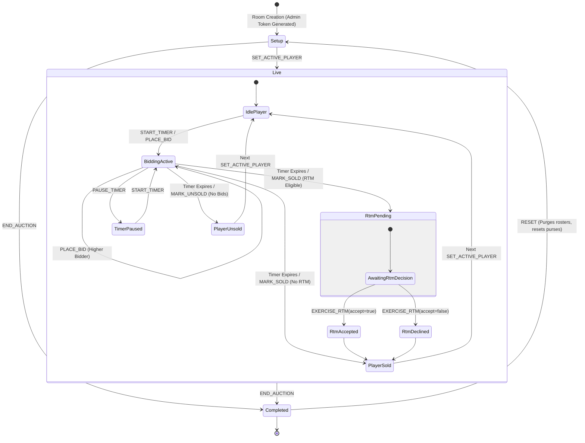

# Cricket Auction Platform - Authoritative State Machine Specification

## 1. Overview
The Cricket Auction Platform implements a server-authoritative, deterministic state machine. All state mutations are persisted to an embedded SQLite database using a strict **write-then-broadcast** pattern. If the database write fails, the in-memory mutation is not acknowledged, and no WebSocket sync event is dispatched to clients.

---

## 2. State Transition Diagram

---

## 3. States & Sub-states

| State | Description | Invariant & Mutation Rules |
| :--- | :--- | :--- |
| `setup` | Initial room configuration | Players imported, teams initialized with purse, no player on auction table. |
| `live` | Auction in session | One active player at a time. Teams may place legal bids subject to increment and purse limits. |
| `paused` | Clock stopped by admin | No countdown ticks occur; new bids may or may not be accepted depending on admin setting. |
| `rtm_pending` | Right-to-Match decision window | Bidding is locked. The retaining franchise must choose within timer to match the highest bid. |
| `completed` | Tournament auction closed | All mutations locked. Admin may review final rosters or trigger a total reset. |

---

## 4. Bidding Rules & Invariants

### 4.1 Opening Bids
- **Legal Opening Bid Rule:** When bidding opens for a player (`currentBid === 0`), any team may place an opening bid at exactly the player's `basePrice`.
- Bids below `basePrice` are rejected with `400 / ERROR: Bid rejected - check legal increment, base price, or purse balance`.

### 4.2 Increment Tiers
Subsequent bids must increase by at least the tier-specified minimum increment:
- Current Bid < 100 Lakhs: **5 Lakhs**
- 100 Lakhs ≤ Current Bid < 200 Lakhs: **10 Lakhs**
- 200 Lakhs ≤ Current Bid < 500 Lakhs: **20 Lakhs**
- Current Bid ≥ 500 Lakhs: **50 Lakhs**

### 4.3 Bid Invariants
1. **Self-Bidding:** A team cannot bid against itself (`currentBidderId === teamId` is rejected).
2. **Purse Ceiling:** A team cannot place a bid exceeding its remaining purse (`team.purse < bidAmount` is rejected).
3. **Timer Reset:** Every valid bid resets the room timer to `rules.timerSeconds` and sets a new wall-clock `deadlineAt = Date.now() + timer * 1000`.

### 4.4 Right to Match (RTM)
- If enabled for the room, when a player is about to be sold to a non-original franchise, the player's former franchise (`previousTeamCode`) is offered RTM if they hold `rtmCards > 0`.
- **Purse Invariant:** The former franchise may only exercise RTM (`accept = true`) if `rtmTeam.purse >= highestBid`. Accepting deducts `highestBid` from their purse and decrements `rtmCards` by 1.

### 4.5 3-Deep Undo Semantics
- Up to 3 sequential actions can be undone (`UNDO_ACTION`).
- Undo restores memory state and executes `db.revertBidEventsToSnapshot` to truncate `bid_events` in SQLite, ensuring no phantom sales or ghost events persist across restarts.
